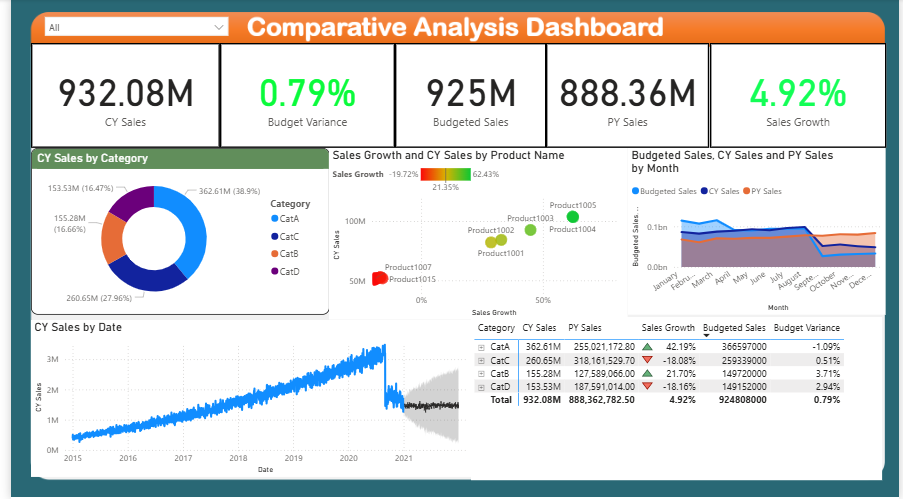
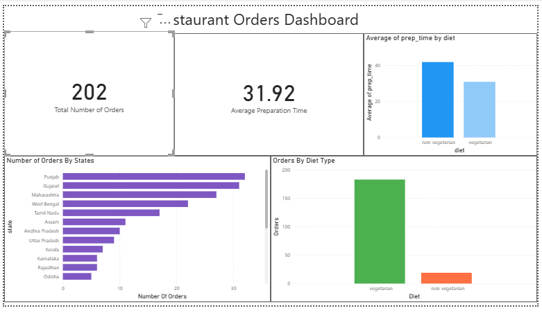
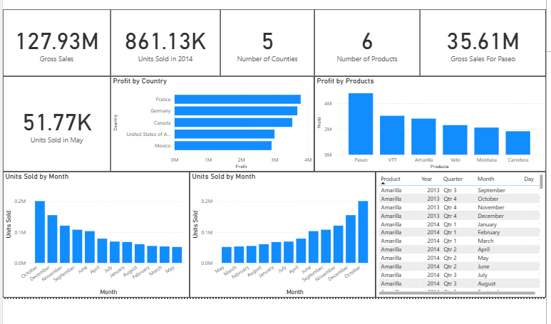
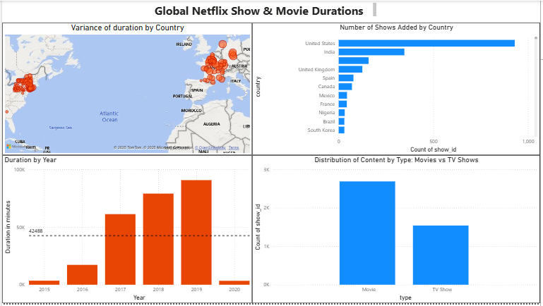

# Power BI Data Visualisation – Dashboard Projects

This repository contains a collection of **interactive Power BI dashboards** developed as part of my **MSc Data Science & Analytics (Advanced Practice)** coursework at **Teesside University, London Campus**.

The projects focus on **insight-driven reporting, KPI tracking, and visual storytelling**.

---

## Project Overview

Each dashboard demonstrates practical skills in:
- Data cleaning & transformation using **Power Query**
- Calculated fields and measures using **DAX**
- KPI development and performance insights
- Interactive and user-focused dashboard design

---

## Tools & Techniques
- Power BI  
- Power Query  
- DAX  
- Data Modelling  
- Visual Storytelling & KPI Reporting

---

## What I Did
- Cleaned and transformed datasets prior to modelling  
- Designed dashboards to highlight:
  - Trends  
  - Comparisons  
  - KPIs & metrics
- Built visuals to support **clarity and decision-making**
- Produced **presentation-ready analytical reports**

---

## Project Files
- Folder: `Data Visualisation - Kweku Koomson (S3577881)/`

---

## Dashboard Screenshots

> Replace with real screenshots after upload

### Dashboard 1

### Dashboard 2

### Dashboard 3

### Dashboard 4

---

## Programme Context
MSc Data Science & Analytics (Advanced Practice)  
Teesside University — London Campus

---

## Connect With Me
- LinkedIn: https://www.linkedin.com/in/kweku-koomson-428902319/  
- Email: koomsonkweku5@gmail.com

---
